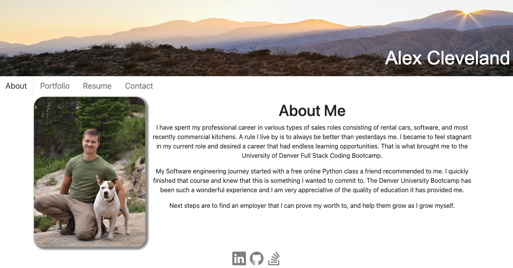
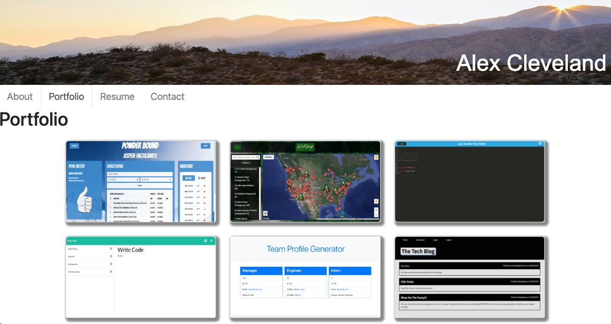
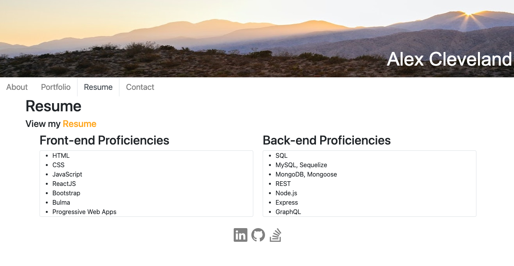
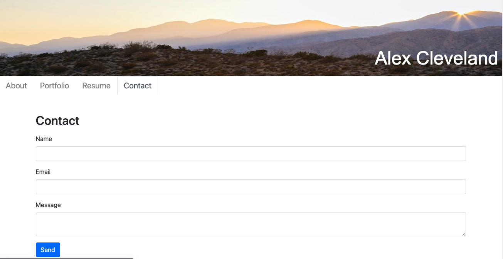

# Alex-Cleveland-Portfolio

## Table of Contents

- [Description](#description)
- [Deployed](#Demo)
- [Technologies](#Technologies)
- [Usage](#usage)
- [Questions](#questions)

## Description

A Portfolio to showcase the projects I have done at Denver University Bootcamp and more.

## Deployed

https://aclevel5.github.io/Alex-Cleveland-Portfolio/

## Technologies
- JavaScript
- React
- HTML
- CSS
- Bootstrap

## Usage

Visit the deployed link. Click on the different tabs to review my bio, portfolio, resume, and contact form.

## Questions
GitHub: [Aclevel5's GitHub](https://github.com/Aclevel5)